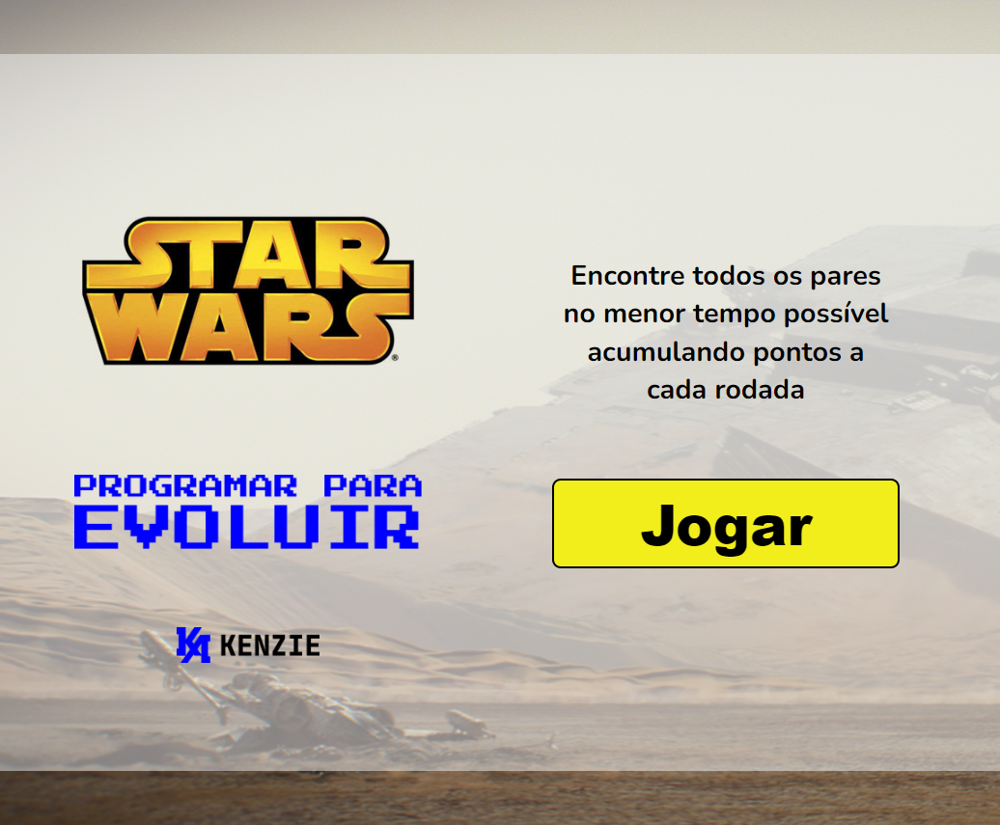

# Meu 1° Projeto Maratona Kenzie => Programar para Evoluir

Projeto desenvolvido para o evento Programar para Evoluir no dia 27 de agosto de 2022.

Foram 8 horas de Live com intervalo de 10 minutos, mais a queda de Energia na casa do Luiz (rsrsrsrs)

[🔗 Clique aqui para acessar](https://toledomg.github.io/Projeto-Maratona-Programar-ParaEvoluir/)

## 🛠️ Tecnologias

- HTML
- CSS
- Javascript
- Git e Github

## Checkpoints aulas

1. [Introdução ao HTML e estruturação do projeto](https://kenzieacademybr.notion.site/Checkpoint-HTML-603966060b18408b9a94e08029552dbc)
2. [Introdução ao CSS e estilização do projeto](https://kenzieacademybr.notion.site/Checkpoint-CSS-25ff90c91bbf469f992d4eb78676b22e)
3. [Introdução ao Javascript](https://kenzieacademybr.notion.site/Checkpoint-JS-1daf0ac2fccf43fb9da86579ec013ecf)

## O projeto

### Estrutura de arquivos

- README.md
- index.html
- /src
  - /img
  - /css
    - jogo.css
    - main.css
    - reset.css
  - /js
    - database.js
    - jogo.js
    - main.js
  - pages
    - index.html
    - jogo.html

### Fonte

- 'Nunito', sans-serif;

### Cores

- Branco: #ffffff;
- Gelo: #F4F4F4;
- Amarelo: #FBD000;
- Azul: #049CD8;
- Verde: #43B047;
- Vermelho: #E52521;
- Preto: #000000;
- Cinza Escuro: #1E1E1E;

## Layout

- [Layout Maratona Kenzie => Programar para Evoluir](https://www.figma.com/file/8Amj3A1JAde5kzDlms5cr0/Maratona-Programa-para-Evoluir?node-id=0%3A1)

## LinkedIn das(os) Instrutores

- [Luiz Paulo Reis](https://www.linkedin.com/in/luiz-paulo-reis-cardoso/)
- [Maria Ferrari](https://www.linkedin.com/in/maria-aparecida-guedes-ferrari/)

## repositório Oficial

- [Maratona Kenzie => Programar para Evoluir](https://github.com/Kenzie-Academy-Brasil-Developers/maratona-programarParaEvoluir)

## Referências

- [W3Schools referência HTML](https://www.w3schools.com/tags/default.asp)
- [W3Schools referência CSS](https://www.w3schools.com/cssref/default.asp)
- [Google Fonts](https://fonts.google.com/)
- [Coolors](https://coolors.co/palettes/trending)
- [Paletton](https://paletton.com/)
- [W3Schools propriedades CSS no DOM](https://www.w3schools.com/jsref/dom_obj_style.asp)
- [MDN lista de eventos](https://developer.mozilla.org/en-US/docs/Web/Events)

## ❤️ Contato

toledomg@yahoo.com.br

---

